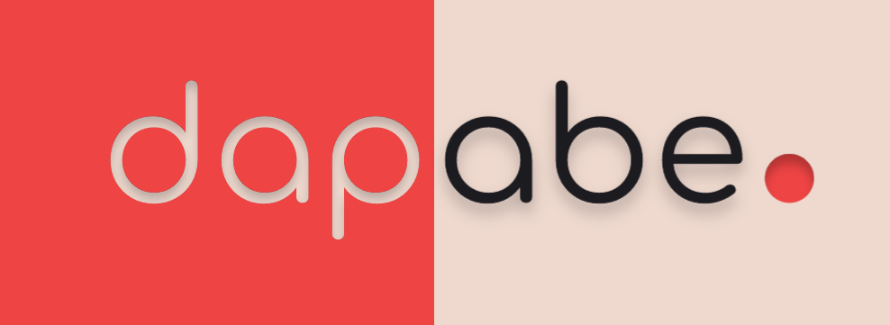

### Leér en [Español](#mi-portafolio)

### Read in [English](#my-portfolio) 

---

# Mi Portafolio

&nbsp;&nbsp;&nbsp;&nbsp; Mi sitio web personal, actualmente es una SPA y está en proceso de migrar a una SSR.
Herramientas de desarrollo:
- React.JS 
- Tailwind CSS

---

# My Portfolio

&nbsp;&nbsp;&nbsp;&nbsp; Mi personal website, right now it's a SPA and it's being in process of being migrated to a SSR.

Development tools:
- React.JS 
- Tailwind CSS
